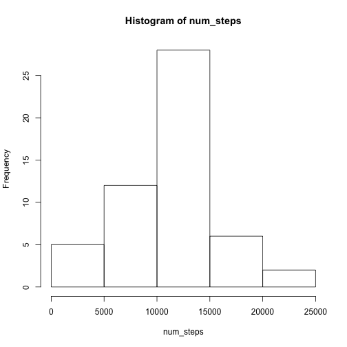
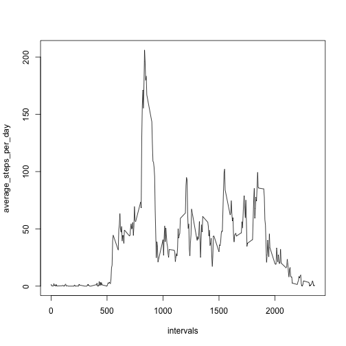
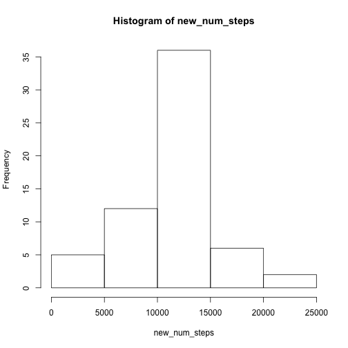
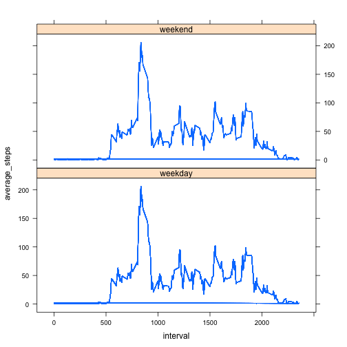

Reproducible Research: Peer Assignment 1
========================================================

Loading and preprocessing the data
----------------------------------

1: Load the data into R using read.csv()


```r
file <- read.csv("./data/activity.csv", stringsAsFactors = FALSE)
```


2: Subset the data using complete.cases() to omit NAs


```r
data <- file[complete.cases(file), ]
head(data)
```

```
##     steps       date interval
## 289     0 2012-10-02        0
## 290     0 2012-10-02        5
## 291     0 2012-10-02       10
## 292     0 2012-10-02       15
## 293     0 2012-10-02       20
## 294     0 2012-10-02       25
```


What is mean total number of steps taken per day?
-------------------------------------------------

1: Use tapply using data as a factor to get number of steps per day. Call hist() to create a histogram with this data.


```r
num_steps <- tapply(data$steps, as.factor(data$date), sum)
hist_num_steps <- hist(num_steps)
```

 


2: Calculate mean and median steps by calling namesake functions on data frame column steps


```r
mean_steps <- mean(data$steps)
mean_steps
```

```
## [1] 37.38
```

```r
median_steps <- median(data$steps)
median_steps
```

```
## [1] 0
```


What is the average daily activity pattern?
-------------------------------------------

1: Get average steps per day per interval using tapply. Create a time series plot (using plot type "l") of intervals (x-axis) against average steps (y-axis)


```r
average_steps_per_day <- tapply(data$steps, as.factor(data$interval), mean)
intervals <- unique(data$interval)
plot(intervals, average_steps_per_day, type = "l")
```

 


2: The 5-minute interval, contains the maximum number of steps on average across all the days in the dataset is interval ```835```. This is found using which.max() to find the index of the max average:


```r
which.max(average_steps_per_day)
```

```
## 835 
## 104
```

```r
average_steps_per_day[104]
```

```
##   835 
## 206.2
```


Imputing missing values
-----------------------

1: Check total number of NAs in each column


```r
na_data <- file
sum(is.na(na_data[, 1]))
```

```
## [1] 2304
```

```r
sum(is.na(na_data[, 2]))
```

```
## [1] 0
```

```r
sum(is.na(na_data[, 3]))
```

```
## [1] 0
```


2: Add a new column to include average steps for each interval to replace any NA value

```r
average_steps <- vector()
for (i in na_data$interval) {
    average <- average_steps_per_day[as.character(i)][[1]]
    average_steps <- c(average_steps, average)
}
new_data <- cbind(na_data, average_steps)
```


3: Create a dataset replacing all NA values with the average for each interval (aka step)

```r
for (i in seq_along(new_data$steps)) {
    if (is.na(new_data$steps[i])) {
        new_data[i, 1] <- new_data[i, 4]
    }
}
```


4: Create a histogram for the total number of steps taken each day

```r
new_num_steps <- tapply(new_data$steps, as.factor(new_data$date), sum)
new_hist_num_steps <- hist(new_num_steps)
```

 


5: Calculate mean and median for dataset with averages substituted for NAs

```r
new_mean_steps <- mean(new_data$steps)
new_mean_steps
```

```
## [1] 37.38
```

```r
new_median_steps <- median(new_data$steps)
new_median_steps
```

```
## [1] 0
```

```Note``` how thes are the same as our original mean and median values:

```r
mean_steps - new_mean_steps
```

```
## [1] 0
```

```r
median_steps - new_median_steps
```

```
## [1] 0
```


Are there differences in activity patterns between weekdays and weekends?
-------------------------------------------------------------------------

1: Create a factor called 'day' taking values weekend and weekday

```r
day <- new_data[, 2]
day <- strptime(day, "%Y-%m-%d")
day <- weekdays(day)
day <- as.character(day)

for (i in 1:length(day)) {
    if (day[i] == "Saturday" | day[i] == "Sunday") {
        day[i] <- "weekend"
    } else {
        day[i] <- "weekday"
    }
}
day <- factor(day)
```


2: Create a plot containing a time series plot using lattice, adding a column for the day factor into the dataframe and then calling an xyplot on averages (y-axis) and intervals (x-axis), separated by day factor. The layout is one plot horizontally and two vertically. The type is "l" for the time series specification.  

```r
library(lattice)
new_data <- cbind(new_data, day)
wkday <- data.frame(new_data, wkday = new_data$day)
xyplot(average_steps ~ interval | wkday, data = wkday, layout = c(1, 2), type = "l")
```

 


